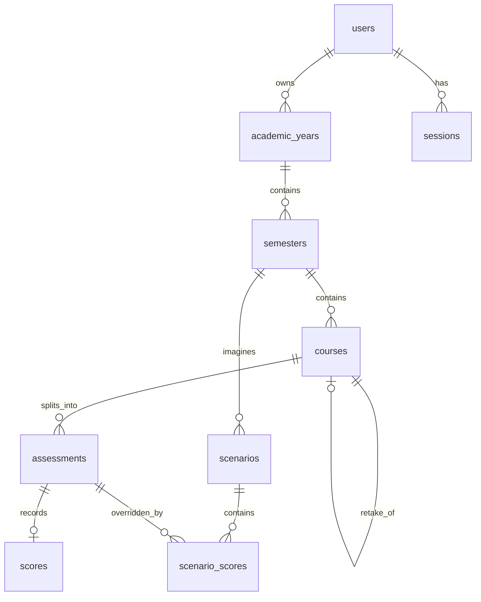
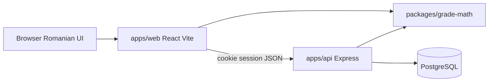
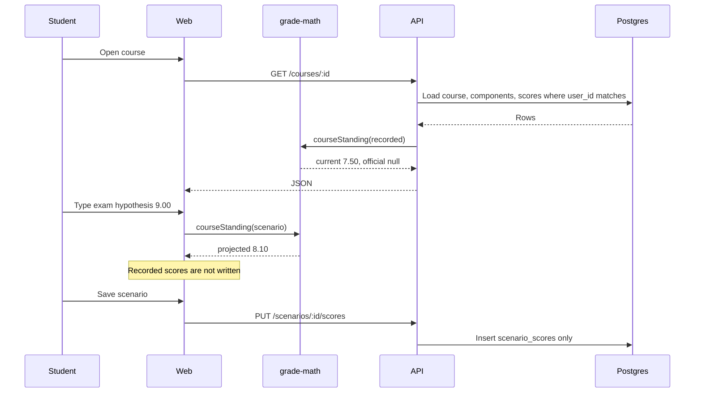

# GradLens specification

Status: decisions closed. This is the document to build from.

GradLens is a web app where one university student records courses, component weights, and marks on the 1.00 to 10.00 scale, then sees a credit-weighted average, a pass or fail, and the mark still needed on the work that is not graded yet. Hypothetical marks live in scenarios and never overwrite recorded marks.

The course constraint is the FAD / BDA internship brief: a real problem, a market comparison, functional and non-functional requirements, an architecture that shows frontend, backend, and database, a data model, UML-ready flows, screens, authentication, CRUD, tests, git history, and a working app by the end of week 7. The curriculum context is Technical University of Moldova, FCIM, Software Engineering. "Bazele dezvoltării aplicațiilor" sits in year 2, semester 3, next to databases and object-oriented programming.

Two limits on facts in this document:

- Claude Opus and GPT Sol were requested to answer the design tree. Both calls stopped with an other-models usage limit, so they produced nothing. The decisions below were made in this session.
- The current UTM Chișinău assessment regulation could not be re-fetched while writing this. The 1 to 10 scale and the pass mark of 5 are the national higher-education scale. The 60/40 split and the ECTS letter bands are stored as editable data, not as hard-coded law. If the fișa disciplinei disagrees, the student edits the course. The app does not pretend one formula covers every subject.

---

## 1. Decisions

Each item is one closed branch. Later sections are the implementation of these choices.

| # | Question | Decision |
| --- | --- | --- |
| 1 | What is the product? | A personal grade lens for one student. Not a teacher gradebook. |
| 2 | Platform? | Web app, presented from a laptop. No Android or iOS app in this project. |
| 3 | Who can see a row? | The account that owns it. There is no shared class and no admin view of other students. |
| 4 | Scale? | Marks from 1.00 to 10.00 inclusive. Pass line 5.00. |
| 5 | One formula for every course? | No. Each course has components whose weights sum to 100. A preset fills in 60 current and 40 exam. The student can change it. |
| 6 | What does "current average" mean when the exam is missing? | Average over the weight that already has a mark. Missing weight is not treated as zero. |
| 7 | What does "projected average" mean? | It exists only when every component has either a recorded mark or a hypothetical mark. |
| 8 | Are what-if marks saved? | Yes, as named scenarios. They never write the real score row. |
| 9 | Grade needed? | Solve for the average still required on the ungraded weight, then apply the exam floor of 5.00 when that rule is on. |
| 10 | Credits? | Required on every course. Semester and cumulative averages are credit-weighted. |
| 11 | Retake? | A new attempt. The previous passed mark stays in the official average until the new attempt has a final mark. Credits count once. |
| 12 | Auth? | Email and password. Session row in Postgres. httpOnly cookie. Open registration. No email verification. |
| 13 | Password hashing? | bcrypt, cost 12. Argon2id was rejected because a native build can break a demo laptop. |
| 14 | Stack? | npm workspaces: React + Vite web app, Express API, shared `grade-math` package, PostgreSQL, Prisma. |
| 15 | Where is the math? | One pure package imported by the API and the web app. The database stores inputs, not cached averages. |
| 16 | Numbers? | Decimal arithmetic. Persist and display with half-up rounding to 2 decimal places. |
| 17 | UI language? | Romanian. Code, API error codes, and this document stay in English. |
| 18 | Demo path? | `docker compose up` on the presentation machine. A hosted URL is optional and not required to pass. |
| 19 | Team shape? | Buildable by one person. A second person takes the web app, a third takes the written diagrams. |
| 20 | Sync with ELSE / Moodle? | Out of scope. |

---

## 2. Problem

A student at FCIM learns a mark only after doing the arithmetic by hand. The course sheet splits a subject into labs, a test, and an exam, each with its own weight. The semester average then weights those course marks by credits. A spreadsheet can do this until a weight is edited, a retake is added, or a cell is left blank and counted as zero. The university Moodle (ELSE, at else.fcim.utm.md) shows what a professor has entered. It does not give the student a private place to ask "if the exam is an 8, what happens to this course and to the semester."

GradLens is that place. The student types the same numbers that are already on the fișa disciplinei and on returned work. The app answers three questions: what the course is worth from the work already graded, what it becomes under a hypothetical exam, and what exam mark is still required to hit a target.

Success for the user: after entering one real semester, the official credit-weighted average matches a hand calculation to 2 decimal places, and the "nota necesară" matches the worked example in section 7.

Success for the course: a professor can log in as the demo student, change one hypothetical exam mark, and watch the course mark and the semester average move, without the recorded mark changing.

---

## 3. Users

**Primary persona, Ana, year 2, Software Engineering.** She has about six courses and 30 ECTS in the current semester. She knows her lab marks. She does not know whether an 8 on the exam is enough for a target of 8 on the course, or what that does to the semester average. She will use GradLens once a week and the night before an exam. She abandons it if entering a course takes more than two minutes, or if a blank exam is treated as a zero.

**Secondary persona, the presenter.** Same person, on defense day, on a projector. Needs a seeded account with one finished semester and one semester in progress, plus a scenario that can be edited live.

**Not a user.** Professors entering official marks. Parents. Faculty staff running reports. Those jobs belong to the university system.

Job to be done: when a mark is published or an exam is coming, record it and see the credit-weighted consequence in under a minute.

Value proposition: GradLens shows the current mark from graded work only, the mark required on what is left, and the credit-weighted semester result, on the 1 to 10 scale, without mixing those numbers with guesses.

---

## 4. Existing solutions

No user counts are stated here. Prices and feature details move. What follows is the distinction that matters for this project.

| Product | What it is | What it does well | What it does not do for this student | GradLens difference |
| --- | --- | --- | --- | --- |
| Excel or Google Sheets | The tool students already use | Any formula the owner can write | A blank cell becomes a silent zero. Retakes and "who is allowed to see this" are not a model. There is no auth. | Weights, blanks, retakes, and ownership are rules, not cells. |
| ELSE / Moodle (else.fcim.utm.md) | The faculty course site | Official items a professor publishes | The student does not own a cross-semester what-if. Weight setup depends on the teacher. | Private planning record the student controls. It is not the system of record. |
| MyStudyLife | Student planner on web and mobile | Timetable and tasks | Public descriptions treat it as a planner. Grade tools are not a 1 to 10 credit-weighted transcript built from a Moldovan course sheet. | Grades and credits are the whole product. There is no timetable. |
| Power Planner | Grade and GPA tracker | What-if GPA across a term | Built around GPA points and credit hours used in other systems, not component weights on a 1 to 10 course. | Component weights and the 1 to 10 pass rule are first-class. |
| RogerHub final grade calculator | Single-page calculator at rogerhub.com/final-grade-calculator | "What do I need on the final" for one sitting | Nothing is saved. No account, no semester, no credits. | Same question, kept per course, then rolled into the semester by credits. |
| Evalio (York University student project, public GitHub) | Web app with weights, targets, what-if, saved scenarios | The closest shape: assessments, required score, scenarios | Its own notes say the dashboard average is equal-weight across courses when credits were not collected. | Credits are required. The semester average is always credit-weighted. The scale is 1 to 10. |

Differentiation a professor can check:

1. Blank work is excluded from the current mark. It is not a zero.
2. A projection is shown only when every component is either recorded or hypothetical.
3. Semester and cumulative averages are weighted by ECTS credits.
4. A retake does not delete the previous passed mark from the official average until the new attempt is final.
5. Hypothetical scores are a separate table. Saving a scenario does not update `scores`.
6. The pass rule can require the exam itself to be at least 5.00, which a plain average hides.
7. Every query is scoped by the logged-in user.

---

## 5. Scope

### In scope for week 7

- Register, log in, log out.
- Academic year, semester, course, assessment components, one recorded result per component.
- Weight validation (sum must be 100.00).
- Current course mark, official course mark, ECTS band, pass or fail.
- Credit-weighted semester average and cumulative average.
- Credits earned and credits attempted.
- Required mark on the remaining weight for a target.
- Named what-if scenarios that override or fill components without writing `scores`.
- Retake attempts with the replacement rule in section 7.
- JSON export of the caller's own data.
- Seeded demo account.
- Tests listed in section 14.

### Out of scope

- ELSE, Moodle, or any import.
- Teachers, classes, rosters, parents, faculty dashboards.
- Attendance, timetable, deadlines, notifications.
- Email verification, password-reset email, OAuth.
- Native mobile apps.
- Scanning a syllabus with a model.
- Dropping the lowest component.
- Relative (curve) grading.
- A second scale (4.0, letter-only) in the same account.
- Storing raw point scores as the source of truth. A converter may assist entry. The saved value is always a 1.00 to 10.00 mark.
- Multi-user collaboration on one transcript.

---

## 6. Requirements

### Functional

1. A visitor can register with name, email, and password, then log in and log out.
2. A logged-in student can create, rename, and delete an academic year, and create semesters inside it.
3. A student can create, edit, and delete a course inside a semester. A course has a title, an optional code, credits greater than 0, a target mark or none, and an `exam_must_pass` flag defaulting to true.
4. A student can define 1 to 12 assessment components on a course. Each has a name, a kind, a weight, an order, and at most one of them is the final exam.
5. The course cannot be used for official calculations until component weights sum to exactly 100.00. The API rejects other sums.
6. A student can set each component to pending, graded (with a mark), or absent.
7. The course screen shows the current mark from graded and absent components only, the weight still open, the ECTS band when a final mark exists, and pass or fail when a final mark exists.
8. The course screen shows the mark required on the open weight to reach the course target. If that mark is above 10.00, the screen says the target is impossible and shows the maximum still reachable. If the open weight is 0, it says the target is already met or already missed.
9. A student can save a named scenario with hypothetical marks. The course screen shows recorded and scenario results side by side. Deleting the scenario leaves recorded marks unchanged.
10. The semester screen shows each course, its credits, its current or official mark, and the semester averages defined in section 7.
11. The dashboard shows the cumulative official average, credits earned, and the current semester.
12. A retake is a new course attempt linked to the earlier one. Listing and averaging follow section 7.
13. User A receives 404, not the body, for every year, semester, course, score, and scenario owned by user B.
14. A student can download a JSON file of their own years, semesters, courses, components, scores, and scenarios.
15. Deleting a semester deletes its courses, components, scores, and the scenario rows that point at those components.

### Non-functional

1. Marks and weights are never computed with binary floating point. Use decimal arithmetic in `packages/grade-math` and `NUMERIC` in Postgres.
2. Displayed marks use half-up rounding to 2 decimal places. Stored component marks are the values the student entered, already at 2 decimal places.
3. On the demo laptop, the semester summary for 8 courses with 10 components each is produced by one service call, not by a chatty loop of grade writes. Target: the summary request completes in under 300 ms locally. That target is not a measurement yet.
4. Passwords are stored only as bcrypt hashes at cost 12. The cookie is httpOnly, SameSite=Lax, and Secure in production. It holds the session id, not the user id in a readable token.
5. Logs may contain request ids, user ids, and error codes. Logs must not contain marks, passwords, or session ids.
6. The web UI works at 375 px width and at projector width. The semester table becomes a stack of course cards on a narrow screen.
7. The demo does not depend on a free cloud instance being awake. `docker compose up` is enough.
8. Empty states and failed requests are visible. A spinner is not the only result of an error.

---

## 7. Grade mathematics

All functions live in `packages/grade-math`. They take plain data and return plain data. They do not read the database.

Types used below:

- A mark is a decimal in [1.00, 10.00].
- A weight is a decimal in (0.00, 100.00].
- `ROUND2(x)` is half-up to 2 decimal places.
- A component result is `pending` (no mark), `graded` (has a mark), or `absent`.
- Absent is stored without a numeric mark and counts as 1.00 in every formula. The screen prints "Absent", not "1.00".

### 7.1 Weight rule

Let `W` be the sum of component weights on a course.

- Official and required-mark functions run only when `W = 100.00`.
- The editor may display a draft whose sum is not 100. The draft is not an input to the averages.

### 7.2 Which components count as filled

For the **recorded** view, a component is filled when its status is `graded` or `absent`.

For a **scenario** view, a component is filled when the scenario has a hypothetical mark for it, or when it is already filled in the recorded view and the scenario does not override it. A scenario mark replaces the recorded mark for the calculation only.

### 7.3 Current mark

Let `G` be the filled components in the view being calculated.

```
if sum(weight of G) = 0:
    current = null
else:
    current = ROUND2( sum(mark_i * weight_i) / sum(weight_i) )
```

A pending exam contributes nothing. It does not pull the mark down.

Worked example. Labs 30% at 8.00, test 30% at 7.00, exam 40% pending.

```
sum = 8.00*30 + 7.00*30 = 450.00
current = ROUND2(450.00 / 60) = 7.50
```

Second example, to pin rounding. 8.33 on 30% and 7.66 on 30%.

```
sum = 8.33*30 + 7.66*30 = 479.70
raw = 479.70 / 60 = 7.995
current = ROUND2(7.995) = 8.00
```

### 7.4 Official course mark

The official mark exists only when every component is filled in the **recorded** view and the weights sum to 100.

```
official = ROUND2( sum(mark_i * weight_i) / 100 )
```

This is the same arithmetic as the current mark when the open weight is 0. It is a different field so the UI can refuse to call a partial mark "official".

### 7.5 Projected mark

The projected mark exists only when every component is filled in the view (recorded plus scenario). Same formula as the official mark. If any component is still empty, projected is null and the UI says the projection is incomplete. It does not show a partial projection labeled as a final.

Worked example. The 7.50 course above, scenario exam = 9.00.

```
projected = ROUND2((450.00 + 9.00*40) / 100) = 8.10
```

The recorded current mark stays 7.50.

### 7.6 Exam floor

If `exam_must_pass` is true and a component is flagged `is_final_exam`:

- If that component is still pending in this view, pass state is `incomplete`.
- If it is absent, or its mark is below 5.00, pass state is `failed_exam`, even when the weighted mark is at least 5.00.
- If its mark is at least 5.00 and the official weighted mark is at least 5.00, pass state is `passed`.
- If the official weighted mark is below 5.00, pass state is `failed_mark`.

If no component is flagged as the final exam, only the weighted official mark is compared to 5.00.

The weighted number is always shown. The floor changes the status, not the displayed average.

### 7.7 ECTS band

Seed this table. Edit the rows if the faculty regulation differs. Do not scatter the cutoffs through the UI.

| Band | From | To | Meaning on screen |
| --- | --- | --- | --- |
| A | 9.01 | 10.00 | Excelent |
| B | 8.01 | 9.00 | Foarte bine |
| C | 7.01 | 8.00 | Bine |
| D | 6.01 | 7.00 | Satisfăcător |
| E | 5.00 | 6.00 | Suficient |
| FX | 3.01 | 4.99 | Insuficient |
| F | 1.00 | 3.00 | Insuficient |

A mark of 9.00 is B. A mark of 9.01 is A. A mark of 5.00 is E and is a pass, subject to the exam floor. A null mark has no band.

This mapping is the one commonly published by Moldovan universities. It is seed data because the live UTM regulation was not re-read for this document.

### 7.8 Mark required on the open weight

Let `Sg` be `sum(mark_i * weight_i)` over filled recorded components, `Wg` their weight sum, and `Ws = 100 - Wg`. Let `T` be the target mark.

```
if Ws = 0:
    result = already_met if official >= T else impossible
else:
    x = (T * 100 - Sg) / Ws
```

Then:

- If `x` is below 1.00, the target is already met even at the floor of the scale. Show "deja atins".
- If `x` is above 10.00, the target is impossible. Also show `ROUND2((Sg + 10*Ws) / 100)` as the best still possible.
- Otherwise the required average on the open weight is `ROUND2(x)`.
- If `exam_must_pass` is true and the final exam is still pending, the required exam mark is `max(required average, 5.00)`, then rounded half-up to 2 decimals. If that value is above 10.00, the target is impossible.

Worked example, target 8.00, `Sg = 450`, `Ws = 40`.

```
x = (800 - 450) / 40 = 8.75
```

Same course, target 5.00.

```
x = (500 - 450) / 40 = 1.25
exam floor raises the required exam mark to 5.00
```

Low standing. Labs 4.00 on 30%, test 4.00 on 30%, exam open, target 5.00.

```
Sg = 240
x = (500 - 240) / 40 = 6.50
```

The exam floor does not change 6.50, because 6.50 is already above 5.00.

### 7.9 Semester and cumulative averages

A course contributes a mark only through its **effective attempt**, defined in 7.10.

Three averages, always labeled with these names in the UI:

| UI label | Which course marks | Weights |
| --- | --- | --- |
| Media oficială | Official marks only | Credits |
| Media curentă | Current mark if the official mark is null, otherwise the official mark | Credits of courses that have a current or official mark |
| Proiecție | Scenario projected mark where the scenario fills the course, otherwise the same input as media curentă | Same credits as the courses included |

```
average = ROUND2( sum(mark_c * credits_c) / sum(credits_c) )
```

If the credit sum is 0, the average is null.

Worked semester. Course A, 5 credits, official 8.00. Course B, 4 credits, official 6.50. Course C, 6 credits, current 7.50, exam still open.

```
media oficială = ROUND2((8.00*5 + 6.50*4) / 9) = ROUND2(7.333...) = 7.33
media curentă  = ROUND2((8.00*5 + 6.50*4 + 7.50*6) / 15) = ROUND2(7.40) = 7.40
```

With a scenario that projects course C to 8.10:

```
proiecție = ROUND2((8.00*5 + 6.50*4 + 8.10*6) / 15) = ROUND2(7.64) = 7.64
```

Cumulative averages use the same formulas across every semester, after retake resolution. Do not average the semester averages. Weight every course by its own credits.

### 7.10 Retakes

Attempts at the same subject form a chain via `retake_of_course_id`. The root is the first attempt.

- Credits of a chain count once, using the credits on the attempt that supplies the official mark.
- The official mark of the chain is the official mark of the latest attempt that has one.
- A newer attempt that is not yet official does not remove the previous official mark.
- When the newer attempt becomes official, it replaces the previous official mark, even if it is lower.
- The in-progress card for the new attempt still appears on its semester.

### 7.11 Credits

- Credits earned: sum of credits on chains whose pass state is `passed`.
- Credits attempted: sum of credits on chains that have an official mark.
- A semester total near 30 is normal at UTM and is not enforced. The semester screen shows the credit sum. It does not block saves.

### 7.12 Preset, not a law

Creating a course may start from a preset named "Curent 60 / Examen 40":

| Component | Kind | Weight | Final exam |
| --- | --- | --- | --- |
| Evaluare curentă | activity | 60.00 | no |
| Examen | exam | 40.00 | yes |

`exam_must_pass` starts true. The student can split "evaluare curentă" into labs and a test before any score is saved. Many Moldovan course sheets use a 0.6 / 0.4 split. This project does not claim that every UTM fișă does.

### 7.13 Points helper

Optional and client-side. It does not persist points.

```
linear_1_to_10(points, max) = ROUND2(1 + (points / max) * 9)
linear_0_to_10(points, max) = ROUND2((points / max) * 10)
```

Default the helper to `linear_1_to_10`. If the result is outside [1.00, 10.00], refuse to copy it into the mark field. `20/20` on the default helper is 10.00. `10/20` is 5.50. `0/20` is 1.00.

---

## 8. Data model

Identifiers are UUIDs. Timestamps are `timestamptz`. Marks, weights, and credits are `NUMERIC`, never `float`.

### 8.1 Tables

```sql
CREATE EXTENSION IF NOT EXISTS citext;

CREATE TABLE users (
  id            uuid PRIMARY KEY,
  email         citext NOT NULL UNIQUE,
  name          text NOT NULL,
  password_hash text NOT NULL,
  created_at    timestamptz NOT NULL DEFAULT now()
);

CREATE TABLE sessions (
  id           uuid PRIMARY KEY,
  user_id      uuid NOT NULL REFERENCES users(id) ON DELETE CASCADE,
  token_hash   text NOT NULL UNIQUE,
  expires_at   timestamptz NOT NULL,
  created_at   timestamptz NOT NULL DEFAULT now()
);

CREATE TABLE academic_years (
  id         uuid PRIMARY KEY,
  user_id    uuid NOT NULL REFERENCES users(id) ON DELETE CASCADE,
  label      text NOT NULL,
  UNIQUE (user_id, label)
);

CREATE TABLE semesters (
  id                uuid PRIMARY KEY,
  academic_year_id  uuid NOT NULL REFERENCES academic_years(id) ON DELETE CASCADE,
  user_id           uuid NOT NULL REFERENCES users(id) ON DELETE CASCADE,
  name              text NOT NULL,
  season            text NOT NULL CHECK (season IN ('autumn', 'spring', 'summer')),
  position          integer NOT NULL CHECK (position >= 1),
  UNIQUE (academic_year_id, position)
);

CREATE TABLE courses (
  id                   uuid PRIMARY KEY,
  semester_id          uuid NOT NULL REFERENCES semesters(id) ON DELETE CASCADE,
  user_id              uuid NOT NULL REFERENCES users(id) ON DELETE CASCADE,
  title                text NOT NULL,
  code                 text,
  credits              numeric(4,1) NOT NULL CHECK (credits > 0 AND credits <= 30),
  target_mark          numeric(4,2) CHECK (target_mark IS NULL OR (target_mark >= 1 AND target_mark <= 10)),
  exam_must_pass       boolean NOT NULL DEFAULT true,
  attempt_no           integer NOT NULL DEFAULT 1 CHECK (attempt_no >= 1),
  retake_of_course_id  uuid REFERENCES courses(id) ON DELETE SET NULL,
  created_at           timestamptz NOT NULL DEFAULT now()
);

CREATE TABLE assessments (
  id             uuid PRIMARY KEY,
  course_id      uuid NOT NULL REFERENCES courses(id) ON DELETE CASCADE,
  name           text NOT NULL,
  kind           text NOT NULL CHECK (kind IN ('activity', 'test', 'lab', 'exam', 'other')),
  weight         numeric(5,2) NOT NULL CHECK (weight > 0 AND weight <= 100),
  position       integer NOT NULL CHECK (position >= 1),
  is_final_exam  boolean NOT NULL DEFAULT false,
  UNIQUE (course_id, position)
);

CREATE UNIQUE INDEX assessments_one_final_exam
  ON assessments (course_id)
  WHERE is_final_exam;

CREATE TABLE scores (
  assessment_id  uuid PRIMARY KEY REFERENCES assessments(id) ON DELETE CASCADE,
  status         text NOT NULL CHECK (status IN ('pending', 'graded', 'absent')),
  value          numeric(4,2),
  graded_on      date,
  CHECK (
    (status = 'graded' AND value >= 1 AND value <= 10)
    OR (status = 'pending' AND value IS NULL)
    OR (status = 'absent' AND value IS NULL)
  )
);

CREATE TABLE scenarios (
  id           uuid PRIMARY KEY,
  user_id      uuid NOT NULL REFERENCES users(id) ON DELETE CASCADE,
  semester_id  uuid NOT NULL REFERENCES semesters(id) ON DELETE CASCADE,
  name         text NOT NULL,
  created_at   timestamptz NOT NULL DEFAULT now()
);

CREATE TABLE scenario_scores (
  scenario_id    uuid NOT NULL REFERENCES scenarios(id) ON DELETE CASCADE,
  assessment_id  uuid NOT NULL REFERENCES assessments(id) ON DELETE CASCADE,
  value          numeric(4,2) NOT NULL CHECK (value >= 1 AND value <= 10),
  PRIMARY KEY (scenario_id, assessment_id)
);

CREATE TABLE ects_bands (
  band        text PRIMARY KEY,
  min_mark    numeric(4,2) NOT NULL,
  max_mark    numeric(4,2) NOT NULL,
  label_ro    text NOT NULL
);
```

`user_id` on semesters and courses is deliberate. Authorization checks one column instead of joining the whole tree. On write, the service checks that the parent row has the same `user_id`. A mismatch is a 404.

`retake_of_course_id` must point at a course with the same `user_id`. Enforce that in the service. A cross-user link is a 404.

Scenario scores may only reference assessments whose course sits in `scenarios.semester_id` for that same user. Enforce that in the service.

### 8.2 Entity relationships



### 8.3 Cascade

| Delete | Also deletes |
| --- | --- |
| User | Sessions, years, and everything under them, scenarios |
| Year | Semesters under it |
| Semester | Courses, scenarios for that semester |
| Course | Assessments, and therefore scores. Scenario score rows for those assessments. |
| Assessment | Its score and any scenario scores |
| Scenario | Its scenario scores only. Recorded scores stay. |

Deleting a course that other attempts point at sets their `retake_of_course_id` to null. The service should refuse that delete with `RETAKE_LINK_EXISTS` instead, so the student breaks the chain on purpose. The database `ON DELETE SET NULL` is the backstop.

---

## 9. Architecture

Three processes, one shared library.



The browser talks only to the web app's origin. In development, Vite proxies `/api` to the API. In Docker, nginx serves the web build and proxies `/api` to the API. The cookie stays first-party. That is why a separate JWT in `localStorage` was rejected.

| Piece | Choice | Rejected | Why |
| --- | --- | --- | --- |
| UI | React 18, TypeScript, Vite, React Router, Tailwind | Next.js App Router | The rubric wants a visible frontend and a visible backend. A single Next server hides that line. |
| API | Node.js, TypeScript, Express | Spring Boot | Spring matches the OOP course, and it is the wrong bet for a finished UI in seven weeks. |
| API, second alternative | | FastAPI | Fine technically. The team then keeps two languages. One language across web, API, and math is the smaller risk. |
| Data | PostgreSQL 16 | SQLite | The rubric asks for a real database story, constraints, and cascades. Postgres matches the databases course. |
| Access | Prisma | Hand-written SQL everywhere | Migrations and types. The grade SQL is still explicit in tests. |
| Math | `packages/grade-math` plus `decimal.js` | Math only on the server, or only in the page | Live what-if needs the same functions the API uses. Two copies will drift. |
| Auth cookie | Server session | JWT in localStorage | A script cannot read the session id. |
| Demo | Docker Compose: nginx, api, postgres | Render or Vercel as the only demo | Free tiers sleep. The defense should not. |

### Repository layout

```
apps/web/                React UI
apps/api/src/http/       routes, cookies, error mapping
apps/api/src/services/   ownership checks, transactions
apps/api/src/repos/      Prisma queries
apps/api/prisma/         schema and migrations
packages/grade-math/     pure functions and their tests
docs/GRADLENS_SPEC.md
docker-compose.yml
```

Route handlers parse JSON, call a service, and map a typed error to a status code. They do not compute averages. Repositories do not know HTTP.

### Compute on read

There is no `courses.cached_mark` column. The semester summary service loads the semester's courses, components, scores, and the selected scenario, then calls `grade-math`. A cached column would be a second source of truth and a likely demo bug.

### Package surface

```ts
courseStanding(course, view): {
  current: string | null
  official: string | null
  projected: string | null
  openWeight: string
  band: string | null
  pass: "incomplete" | "passed" | "failed_exam" | "failed_mark"
  maxReachable: string | null
}

requiredOnRemaining(course, target, view): {
  state: "needed" | "already_met" | "impossible" | "no_target"
  required: string | null
  bestPossible: string | null
}

aggregate(courses, mode): {
  average: string | null
  creditsInDenominator: string
}

resolveAttempts(courses): Course[]  // one effective official mark per chain
```

Decimal values cross the package boundary as strings (`"7.50"`), not as JavaScript numbers.

---

## 10. HTTP API

Base path `/api`. Session cookie name `gradlens_session`. Bodies are JSON. Errors:

```json
{ "error": { "code": "WEIGHTS_NOT_100", "message": "Ponderile trebuie să însumeze 100.00.", "details": { "sum": "90.00" } } }
```

Unknown ids and other users' ids both return 404 with code `NOT_FOUND`. Validation returns 400. Bad credentials return 401 with code `INVALID_CREDENTIALS` for both unknown email and wrong password. A missing cookie on a private route returns 401 `UNAUTHENTICATED`.

| Method | Path | Body | Success | Notes |
| --- | --- | --- | --- | --- |
| POST | `/auth/register` | `name`, `email`, `password` | 201, user, sets cookie | 409 `EMAIL_TAKEN` |
| POST | `/auth/login` | `email`, `password` | 200, user, sets cookie | 401 on failure |
| POST | `/auth/logout` | | 204, clears cookie | Deletes the session row |
| GET | `/auth/me` | | 200 user | 401 if no session |
| GET | `/years` | | 200 list | |
| POST | `/years` | `label` | 201 | 409 `YEAR_EXISTS` |
| PATCH | `/years/:id` | `label` | 200 | |
| DELETE | `/years/:id` | | 204 | Cascades |
| POST | `/years/:id/semesters` | `name`, `season`, `position` | 201 | |
| PATCH | `/semesters/:id` | same fields | 200 | |
| DELETE | `/semesters/:id` | | 204 | |
| GET | `/semesters/:id` | | 200 semester plus summary | Query `scenarioId` optional |
| POST | `/semesters/:id/courses` | course fields, optional `preset` | 201 | Preset creates two components and pending scores |
| PATCH | `/courses/:id` | course fields | 200 | |
| DELETE | `/courses/:id` | | 204 | 409 `RETAKE_LINK_EXISTS` if a later attempt points here |
| PUT | `/courses/:id/assessments` | full component list | 200 | Replaces the set in one transaction. Fails with `WEIGHTS_NOT_100`, `FINAL_EXAM_COUNT`, `HAS_SCORES` if any component that would be removed already has a graded or absent score. Pending scores may be replaced. |
| PUT | `/assessments/:id/score` | `status`, `value`, `gradedOn` | 200 | 400 `MARK_RANGE` |
| POST | `/courses/:id/required` | `target` | 200 required-mark object | Does not persist |
| POST | `/semesters/:id/scenarios` | `name` | 201 | |
| PUT | `/scenarios/:id/scores` | list of `{assessmentId, value}` | 200 | Replaces that scenario's scores. 400 if an assessment is outside the semester. |
| DELETE | `/scenarios/:id` | | 204 | |
| GET | `/dashboard` | | 200 cumulative summary and current semester card | |
| GET | `/export` | | 200 JSON attachment | Caller's rows only |
| POST | `/courses/:id/retake` | `semesterId` | 201 new course | Copies components and weights. Does not copy scores. `attempt_no` increments. |

List responses include the computed standing so the UI does not reimplement rules. The web app may also call `grade-math` locally while the user is typing a scenario that is not saved yet.

---

## 11. Screens

Routes:

| Route | Who | What is on it |
| --- | --- | --- |
| `/login` | visitor | Email, password, link to register |
| `/register` | visitor | Name, email, password, password again |
| `/` | student | Dashboard |
| `/years/:yearId` | student | Semesters in that year |
| `/semesters/:id` | student | Course list, three averages, scenario picker |
| `/courses/:id` | student | Components, marks, required mark, scenario column |
| `/account` | student | Name, change password, export button, log out |

Navigation: logo to dashboard, current semester, account. No other top-level areas.

### Dashboard

- Media oficială cumulativă, or "Încă nu ai note finale" when null.
- Credite promovate and credite încercate.
- Card for each semester: name, media oficială, media curentă, credit sum.
- Empty state: "Adaugă un an universitar" and a single button. No sample chart.

### Semester

- Header with the three averages and the credit sum.
- One row per course: title, credits, current or official mark, band if official, pass state, open weight.
- Scenario dropdown. "Fără scenariu" is the default. Choosing one switches the proiecție column without editing marks.
- Button "Curs nou".
- Empty state: "Acest semestru nu are cursuri."

### Course

Two columns on a wide screen, one column on a phone.

Left, recorded:

- Each component: name, weight, status, mark.
- Running total of weights while editing. Save stays disabled until the total is 100.00. The gap is shown as "Mai rămân 10.00".
- Media curentă, and media oficială only when complete.
- Status line: În curs, Admis, Respins la examen, Respins la notă.
- Nota necesară for the target. The target field is on this page.

Right, scenario:

- Same components, hypothetical inputs styled with a dotted field and the word "Ipoteză".
- Proiecție, or "Completează toate componentele pentru proiecție."
- Save scenario, rename, delete.
- A note that is always visible: "Ipotezele nu modifică notele înregistrate."

Deleting a recorded mark returns the component to pending. It does not copy the scenario value in.

### Account

Change password asks for the current password. Export downloads `gradlens-export.json`.

### Errors

- Form field errors under the field, in Romanian.
- A failed load shows the message and a retry button.
- 401 anywhere except login sends the user to `/login`.

### Wireframe, course page

```
Curs: Baze de date          5 credite     Țintă [8.00]
[x] Examenul trebuie promovat cu minimum 5

Componente                         Ipoteză
Laborator   30    8.00             8.00   înregistrat
Test        30    7.00             7.00   înregistrat
Examen      40    — pending        [9.00] ipoteză
Total       100

Media curentă  7.50
Oficială       încă nu
Proiecție      8.10
Nota necesară pe examen pentru 8.00:  8.75
Stare: în curs

[Salvează scenariul]
```

---

## 12. Validation and copy

| Case | Code | Romanian message |
| --- | --- | --- |
| Email not an email | `EMAIL_INVALID` | Introdu un email valid. |
| Password shorter than 8 | `PASSWORD_SHORT` | Parola trebuie să aibă cel puțin 8 caractere. |
| Passwords differ | `PASSWORD_MISMATCH` | Parolele nu coincid. |
| Mark outside 1.00 to 10.00 | `MARK_RANGE` | Nota este între 1.00 și 10.00. |
| Weights not 100.00 | `WEIGHTS_NOT_100` | Ponderile trebuie să însumeze 100.00. |
| More than one final exam | `FINAL_EXAM_COUNT` | Un curs are un singur examen final. |
| Zero or more than 12 components | `COMPONENT_COUNT` | Un curs are între 1 și 12 componente. |
| Credits not in (0, 30] | `CREDITS_RANGE` | Creditele sunt mai mari decât 0 și cel mult 30. |
| Graded status without a value | `MARK_REQUIRED` | O notă înregistrată are nevoie de valoare. |

Password maximum length is 72 bytes because of bcrypt. Longer input returns `PASSWORD_LONG`.

---

## 13. Security

- Registration stores `password_hash` only.
- Login compares with bcrypt. The response time does not need a perfect constant-time path for this project. Unknown email and wrong password share one error code.
- Session token is 32 random bytes, stored as SHA-256 in `sessions.token_hash`. The raw token is only in the cookie.
- Sessions expire after 14 days. Logout deletes the row.
- Every service method takes `userId` from the session, never from the body.
- CORS is not opened to `*`. The browser uses the same origin through the proxy.
- Rate limit login and register to 10 requests per IP per minute in the API process. This is a single-process limit and is enough for the demo.
- The demo seed user is `demo@gradlens.local` with password `Demo12345`. It is a local fixture, documented in the README when that file is written, not an account on a public server unless the team deploys. If they deploy, they change this password.

---

## 14. Tests

`packages/grade-math` tests are pure and required. API tests use Supertest and a test database. These cases are the minimum, not a suggestion.

### Math

| Name | Given | Then |
| --- | --- | --- |
| Current ignores pending | 8.00 on 30, 7.00 on 30, exam pending | current 7.50, official null, open weight 40 |
| Pending is not zero | same | current is not 4.50 |
| Half-up | 8.33 on 30, 7.66 on 30 | 8.00 |
| Projection | scenario exam 9.00 on that course | projected 8.10, recorded current still 7.50 |
| Incomplete projection | scenario fills nothing and exam is pending | projected null |
| Required for 8 | target 8.00, Sg 450, Ws 40 | 8.75 |
| Exam floor raises a low requirement | target 5.00, same course, exam must pass | required exam 5.00, not 1.25 |
| Required when standing is low | 4 and 4 on the two 30% components, target 5 | 6.50 |
| Impossible | target 9.00 on the first course | impossible, best possible 8.50 |
| Already final | all components filled, target at or below official | already_met |
| Absent exam | exam absent, exam must pass, weighted mark 8 | pass `failed_exam`, mark still shown |
| Semester official | credits 5 at 8.00, 4 at 6.50, 6 in progress | official 7.33 on 9 credits |
| Semester current | same, in-progress current 7.50 | current 7.40 on 15 credits |
| Scenario semester | course C projected 8.10 | projection 7.64 |
| Retake keeps the pass | attempt 1 official 8 passed, attempt 2 in progress | official aggregate still uses 8 and counts credits once |
| Retake replaces | attempt 2 becomes official 6.00 | official aggregate uses 6.00, credits once |
| Weights | sum 99.99 | caller receives a domain error and no average |
| Band edge | 9.00 and 9.01 | B and A |
| Pass edge | official 5.00, exam 5.00 | passed, band E |
| No float | inputs as strings | results equal the decimal cases above, not a binary approximation |

### API

| Name | Then |
| --- | --- |
| Register and me | 201, then GET `/auth/me` returns the name |
| Duplicate email | 409 |
| Login failure | 401 `INVALID_CREDENTIALS` |
| Create year, semester, course with preset | two components, weights 60 and 40, both pending |
| Put assessments summing to 90 | 400 `WEIGHTS_NOT_100`, previous rows unchanged |
| Put a graded mark 11 | 400 `MARK_RANGE` |
| Semester summary | matches the 7.33 / 7.40 fixture |
| Scenario put | GET semester with `scenarioId` returns 8.10 on that course and does not change GET without the query |
| User isolation | user B's cookie on user A's course, semester, scenario, and export returns 404 and no title in the body |
| Delete semester | following GET is 404 and the other user's rows remain |
| Export | body contains only the caller's course titles |

---

## 15. Seven week build

Each Friday is something a mentor can click.

| Week | Build | Friday demo |
| --- | --- | --- |
| 1 | This spec. Repo, Docker Compose, Prisma migration, register and login. | Two users can register. User B cannot open user A's empty dashboard data. |
| 2 | Years, semesters, courses, Romanian shell, empty states. | Create a semester and three courses with credits. |
| 3 | Assessment editor, weight rule, score entry, preset 60/40. | Save is blocked at 90. A pending exam can be stored. |
| 4 | `grade-math` and the semester summary wired to the API. Math tests green. | The 7.50 / 7.33 / 7.40 fixture is on screen and matches a calculator. |
| 5 | Required mark, scenarios, retake rule. | Change the hypothetical exam from 9.00 to 6.00. Recorded 7.50 does not move. Projection and semester proiecție do. |
| 6 | Narrow layout, copy, export, error states, seed. | Demo account opens on the projector with the fixture already loaded. |
| 7 | Bug passes only. UML exported from the diagrams in this document. README run steps. Presentation. | The script in section 17, on a cold `docker compose up`. |

If a week slips, drop retakes before dropping the math tests or the weight rule. A wrong average fails the project. A missing retake is a stated limit.

---

## 16. Diagrams for the written report

### Use case

Actors: visitor, student.

Visitor: register, log in.

Student: manage years, manage semesters, manage courses, edit components, record a mark, read averages, ask for the required mark, save a scenario, start a retake, export, log out.

### Sequence, the defense path



### Activity, recording a mark

Start, choose component, enter status. If graded, check 1.00 to 10.00. If the check fails, show `MARK_RANGE` and stop. If it passes, upsert `scores`. Recompute standing on read. If every component is filled and weights are 100, set the response official mark and pass state. End.

### Class sketch

`GradeMath` has no fields. `CourseService` depends on `CourseRepo`, `ScoreRepo`, and `GradeMath`. `AuthService` depends on `UserRepo` and `SessionRepo`. Controllers depend on services. This is the split to draw, not a dozen empty interfaces.

---

## 17. Presentation script

1. Log in as `demo@gradlens.local`.
2. Open the in-progress semester. Show media oficială 7.33 and media curentă 7.40.
3. Open the course whose exam is empty. Show media curentă 7.50 and nota necesară 8.75 for a target of 8.00.
4. Type 9.00 in the hypothesis. Show proiecție 8.10. Reload the page without saving and show that 9.00 is gone.
5. Save the scenario, open the semester, and show proiecție 7.64.
6. Log in as a second user and show an empty dashboard.
7. Mention, in one sentence, that ELSE remains the official record and GradLens is the student's planning copy.

---

## 18. Risks

| Risk | What we do |
| --- | --- |
| The fișa uses a formula this preset does not match | Weights are editable. The report says the preset is a starting point. |
| ECTS cutoffs in the faculty PDF differ | Change `ects_bands` seed. No UI rewrite. |
| A blank exam was implemented as zero | The math test "Pending is not zero" is in week 4 and stays. |
| bcrypt or Prisma native install fails on the demo machine | Docker is the demo. Node on the host is only for development. |
| Scope grows into Moodle sync | Section 5 is the refusal list. Sync is a later project. |
| Two people "fix" the average in the React page | ESLint boundary: apps may import `grade-math` and must not reimplement the formulas. Review against the worked examples. |

---

## 19. Implementation order inside a feature

For any new entity, the order is migration, service ownership check, route, math if needed, web screen, test. A screen that writes a mark before the weight rule exists is how the week 4 demo ends up wrong.

The first code after this document is the `grade-math` tests from section 14, before the forms. The fixtures are already numbers. The UI then has an oracle.
